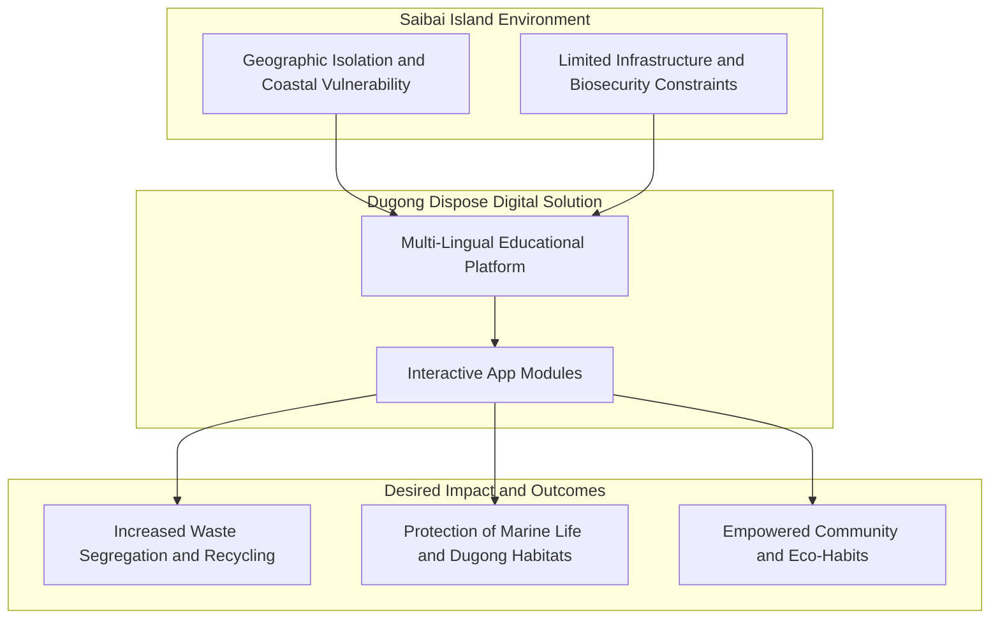
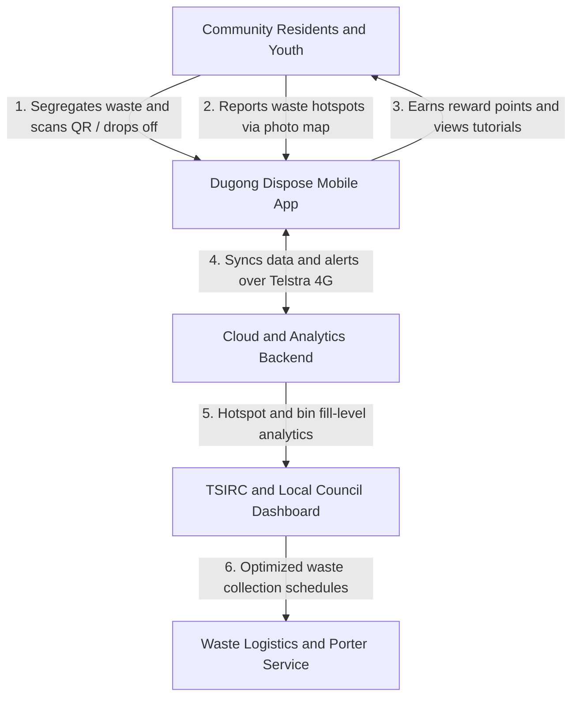
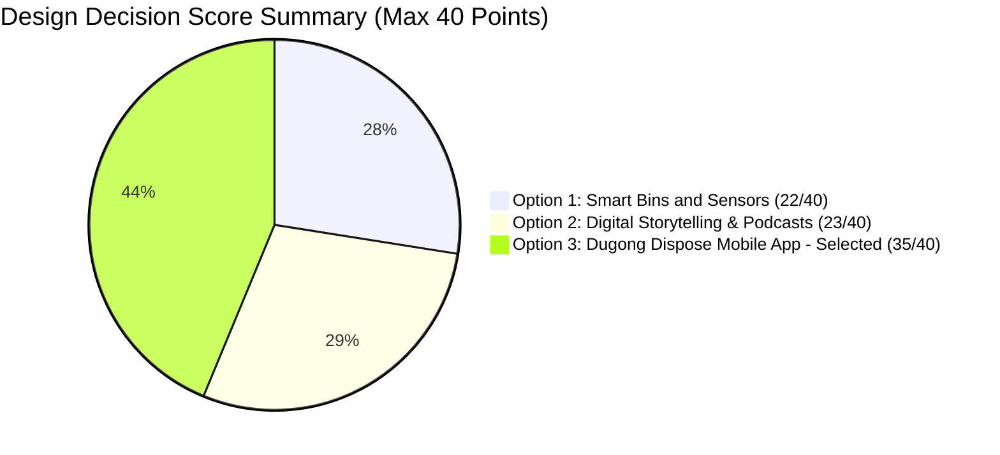
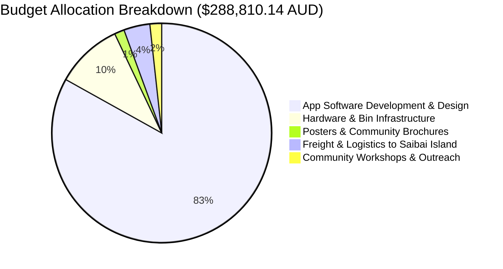

# Dugong Dispose: Digital Education for Waste Management on Saibai Island 🌊🚮

> **Engineers Without Borders (EWB) Challenge 2024 Project Report**  
> **Course:** Introduction to Engineering Projects  
> **Group Name:** EDTECH DUGONGS (Tutorial 01, Zone Blue)  
> **Design Area:** 6. ICT | **Opportunity 6.3:** Language, knowledge preservation, and digital education tools  
> **GitHub Profile:** [anushree05girish](https://github.com/anushree05girish)

---

## 📌 Executive Summary & Project Overview

**Dugong Dispose** is an interactive, multi-lingual digital mobile application designed to educate, engage, and empower the Indigenous community on Saibai Island (Torres Strait) towards sustainable waste management practices. 

Saibai Island faces severe waste management challenges due to its remote geographic location, low-lying topography, limited infrastructure, and vulnerable marine ecosystem. The **Dugong Dispose** platform bridges critical knowledge gaps by presenting waste disposal guidance in English, local Saibai languages, and Torres Strait Creole, tailored across all age demographics.



---

## 🎯 How Might We (HMW) Statement

> *"How might we effectively educate and engage the Saibai community on sustainable waste management practices in order to increase awareness and adoption of effective waste management methods?"*

---

## 🏗️ System Architecture & Data Flow



---

## ✨ Key Features & Application Modules

1. **📊 Waste Monitoring System**
   - Tracks waste generation trends across households and public areas.
   - Provides real-time insights to local council and community members for optimized collection schedules.

2. **🎁 Rewards-Based Incentive System**
   - Encourages community participation by awarding points for proper waste segregation and recycling.
   - Points can be redeemed for local community rewards or discount incentives on waste disposal fees ($10 to $8 reduction).

3. **💬 In-App Community Forum**
   - Enables residents to post waste-related updates, share eco-friendly tips, arrange community clean-ups, and voice environmental concerns.

4. **🔔 Smart Notification Alerts**
   - Sends timely updates regarding bin pick-up times, community clean-up drives, and educational highlights.

5. **🎮 Gamified Waste Map & Educational Mini-Games**
   - Interactive map featuring gamified challenges specifically tailored to engage youth (Gen-Z / children).
   - Teaches waste sorting and marine protection through fun, culturally relevant mechanics.

---

## ⚖️ Design Decision Matrix Analysis



### 📋 Detailed Criteria Evaluation Table

| Evaluation Criteria | Option 1: Smart Bins | Option 2: Storytelling | Option 3: Dugong Dispose App (Selected) |
| :--- | :---: | :---: | :---: |
| **1. Implementation Cost (Low=5)** | 1 / 5 | 4 / 5 | **3 / 5** |
| **2. Maintenance Demand (Low=5)** | 2 / 5 | 4 / 5 | **4 / 5** |
| **3. Daily Functionality** | 4 / 5 | 3 / 5 | **5 / 5** |
| **4. Accessibility Support** | 3 / 5 | 3 / 5 | **5 / 5** |
| **5. Simplicity** | 2 / 5 | 4 / 5 | **4 / 5** |
| **6. Environmental Impact** | 4 / 5 | 3 / 5 | **4 / 5** |
| **7. Community Engagement** | 3 / 5 | 4 / 5 | **5 / 5** |
| **8. Cultural Relevance** | 3 / 5 | 1 / 5 *(Ethics Risk)* | **5 / 5** |
| **Total Score** | **22 / 40** | **23 / 40** | **35 / 40** |

---

### 🗑️ Physical Color-Coded Waste Bin Infrastructure Integration

To complement the mobile app, a physical 4-category color-coded bin system (adapted for local conditions) is established at community hotspots:

```
┌─────────────────────────┬─────────────────────────┬─────────────────────────┬─────────────────────────┐
│     🟢 GREEN BIN        │     🟡 YELLOW BIN       │       🔴 RED BIN        │       🔵 BLUE BIN       │
├─────────────────────────┼─────────────────────────┼─────────────────────────┼─────────────────────────┤
│ Organic Garden Waste &  │ Recyclable Metals,      │ Burnable / Combustible  │ Non-Burnable Materials  │
│ Vegetation              │ Plastics & Glass        │ Non-Recyclable Waste    │ Safe for Incineration   │
└─────────────────────────┴─────────────────────────┴─────────────────────────┴─────────────────────────┘
```

---

## 💰 Project Budget & Cost Breakdown

The overall estimated budget for **Dugong Dispose** is **$288,810.14 AUD** for complete development and rollout, with an ongoing maintenance budget of **$6,994.41 AUD/year**.



| Expense Category | Description & Scope | Cost (AUD) |
| :--- | :--- | :--- |
| **Software Development** | 6-Month Agile development (PM, UI/UX, iOS/Android Devs, QA) | $240,000.00 |
| **Physical Infrastructure** | Color-coded 4-bin sets for 15 primary community hotspots | $28,500.00 |
| **Educational Materials** | 73 Household brochures + 15 Community hotspot QR posters | $4,200.00 |
| **Logistics & Freight** | Marine barge transport (Sea Swift) to remote Saibai Island | $11,110.14 |
| **Outreach & Translation** | Community elder collaboration & TSIRC workshops | $5,000.00 |
| **Total Initial Investment**| **Full Initial Project Deployment** | **$288,810.14** |
| **Annual Maintenance** | Ongoing bug fixes, Telstra 4G cloud hosting & updates | **$6,994.41 / year** |

---

## 👥 Team Members & Contributions

| Student Name | Student ID | Mid-Semester Contributions | End-Semester Contributions |
| :--- | :--- | :--- | :--- |
| **Anushree Girish** | **25415098** | Design Solution Options | Executive Summary + Prototyping |
| **YuetTing Wong** | 25498852 | Project Scope | Detailed Design |
| **Riley Backhouse** | 25358829 | Introduction | Implementation Plan |
| **Michelle Pham** | 24521318 | Proposed Design Solution | Cost Analysis |
| **Sungjin Cho** | 25582065 | Conclusion | Discussion |
| **Mahaba Kamal** | 25579196 | Background | Prototyping |

---

## 🛠️ Implementation & Infrastructure Strategy

- **Material Sourcing & Marketing:** Posters integrated with QR codes distributed across 15 high-traffic locations on Saibai Island for seamless app access and sign-ups. Color-coded bin systems introduced alongside educational media.
- **Stakeholder Collaboration:** Developed in direct alignment with EWB, Torres Strait Island Regional Council (TSIRC), local elders, and residents.
- **Sustainability & Maintenance:** Long-term app maintenance handled through council partnerships with periodic content updates based on user feedback.

---

## 📁 Repository Structure

```text
.
├── README.md                                       # Comprehensive Project Documentation with Clean Mermaid Diagrams & Visuals
└── Assessment Task 2b_ EWB Challenge Team Report.pdf  # Full Project Engineering Report (PDF)
```

---

## 📄 License & Acknowledgements

We acknowledge the Traditional Custodians of the land on Saibai Island, the **Koeybuway** and **Moegibuway** peoples, and pay our respects to their Elders past, present, and emerging. Developed as part of the EWB Challenge 2024 for Introduction to Engineering Projects.
